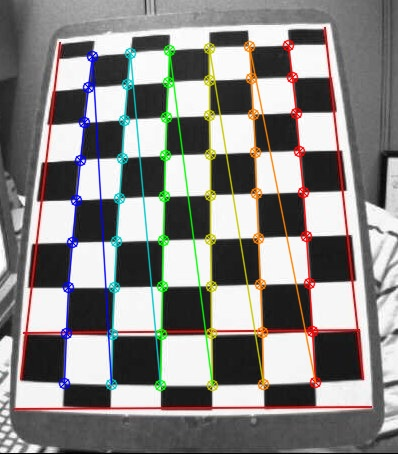
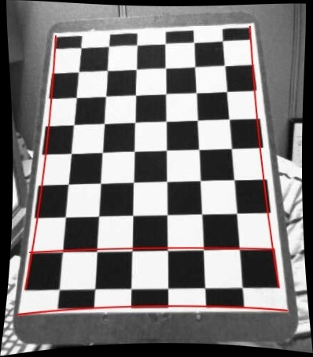

# camera-calibration
camera calibration using opencv
https://docs.opencv.org/4.x/dc/dbb/tutorial_py_calibration.html

## Usage
1. Put chessboard pattern images in imgs directory
2. ```python3 src/calib.py```
3. Unidstorted images and camera matrix, distortion coefficients will be saved in result directory.

## Results
In your results directory, you can get images like below.
### Draw chessboard corners


### Undistorted images


You can also get `calib.json` in your result directory
```
{
    "camera matrix": [
        [
            539.50076787744,
            0.0,
            192.88507782453635
        ],
        [
            0.0,
            563.0075686300647,
            274.304769254872
        ],
        [
            0.0,
            0.0,
            1.0
        ]
    ],
    "distortion": [
        -0.1874487251565031,
        -0.727961904806251,
        -0.03235403706978397,
        0.010656194112595743,
        1.4285953970147887
    ]
}
```